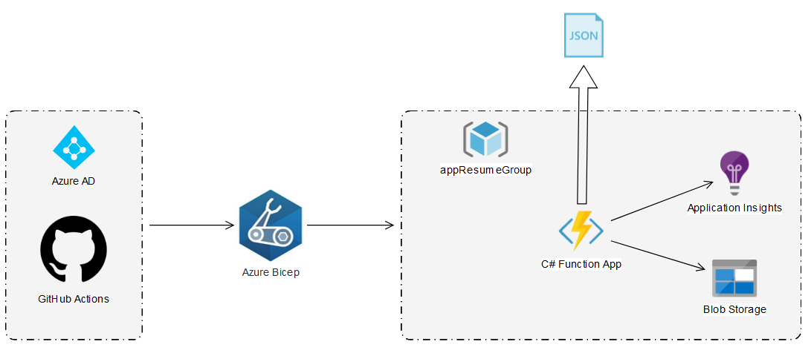

# apiResume

# JSON resume with Github Actions, Bicep and Azure Functions

## **Architecture Diagram:**

## **Description**
This [APP](https://fnappgtmx2f7kdzjgk.azurewebsites.net/api/getCV) is a simple API that allows you to host a resume in the form of a JSON file on the web. It has the following components:

* **GitHub Actions** for continuous integration and deployment. GitHub Actions is a powerful automation tool that allows you to build, test, and deploy your code to any platform. In this app, we use GitHub Actions to set up a continuous integration and deployment (CI/CD) pipeline that automatically builds and deploys the app whenever new code is pushed to the repository.

* **Bicep** file to automate the creation of the infrastructure on Azure. Bicep is a high-level language for declaring Azure infrastructure as code. In this app, we use a Bicep file to define all of the Azure resources that the app needs, such as Azure Functions, Storage Accounts, and Application Insights. This makes it easy to automate the deployment and management of the app's infrastructure.

* **Azure Functions** (written in dotnet 6.0) as the app's backend. Azure Functions is a serverless compute service that lets you run code on-demand without having to worry about the underlying infrastructure. In this app, we use Azure Functions to host the API that serves the resume JSON file.

* **Storage Account** to store data and files. In this app, we use a Storage Account to store the resume JSON file.

* **Application Insights** for monitoring and logging. Application Insights is a powerful tool for monitoring and diagnosing problems in your app. In this app, we use Application Insights to track performance and error metrics, as well as to log requests and responses.

## **To Set Up:**
To set up a new instance of the API, follow these steps:

1. Fork the repository and clone it to your local machine.
2. Install the required dependencies by running `npm install` in the root directory of the project.
3. Create a new Azure Functions app and configure the required resources (Storage Account, Application Insights, etc.) using the Bicep file provided in the repository.
4. Set up a continuous integration and deployment (CI/CD) pipeline using GitHub Actions to automatically build and deploy the app whenever new code is pushed to the repository.

## **Known Issues / Improvements**:

There are many potential enhancements that could be made to the API in the future, including:

* Adding authentication and authorization to protect the resume data
* Adding more endpoints to allow for more sophisticated interactions with the data
* Integrating with other services, such as job board APIs or resume parsing libraries
* Adding a frontend to the app to allow users to view and interact with the resume data more easily
* Caching layer to the API to improve performance and reduce the load on the Storage Account